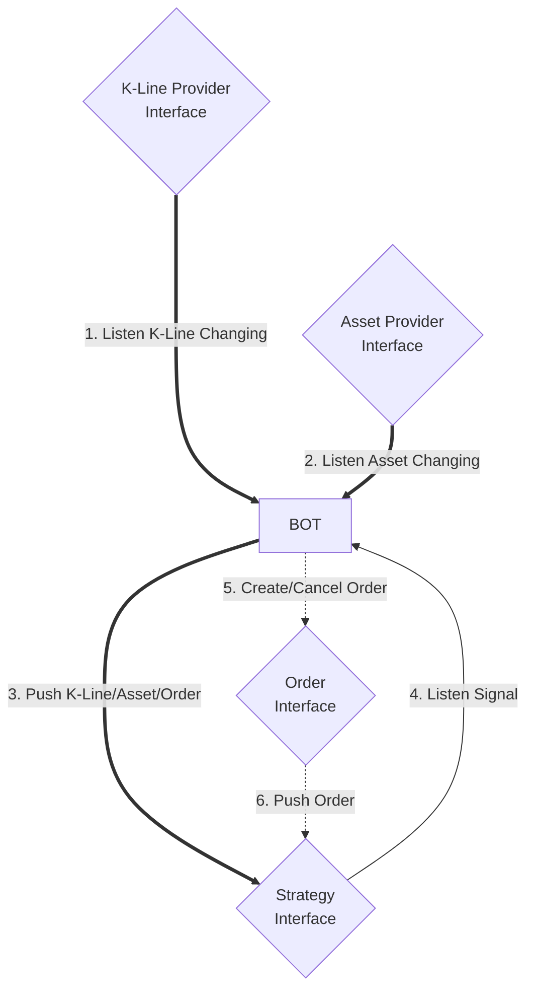

# Treasure Bowl

A simple crypto trading bot.

# Requirement
#### _Go 1.21.4 or higher_

# Flow Design

```mermaid
graph TD
    KLineProvider{"K-Line Provider\nInterface"}
    AssetProvider{"Asset Provider\nInterface"}
    Strategy{Strategy\nInterface}
    Order{Order\nInterface}

    KLineProvider ===>|1. Listen K-Line Changing| BOT
    AssetProvider ==>|2. Listen Asset Changing| BOT
    BOT ==>|3. Push K-Line/Asset/Order| Strategy 
    Strategy -->|4. Listen Signal| BOT
    BOT -.->|5. Create/Cancel Order| Order
    Order -.->|6. Push Order| Strategy
```
# TODO
- KLineProvider: victor 研究中
- AssetProvider
- Strategy
- Order