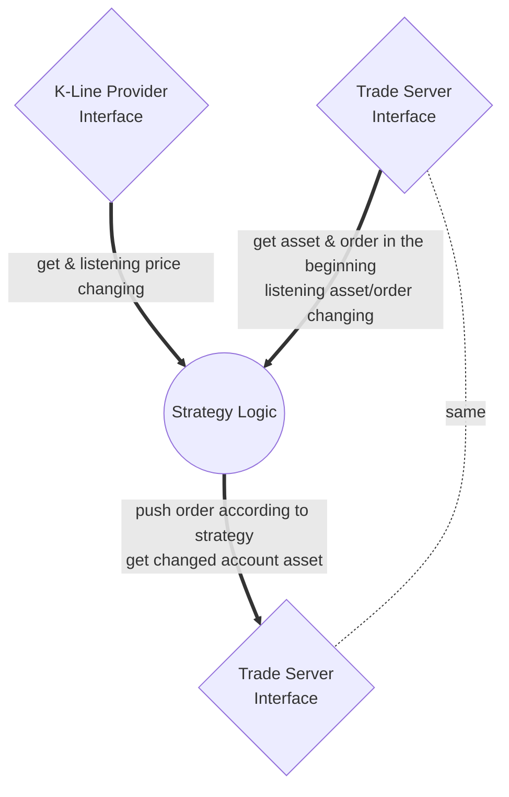

# Treasure Bowl

A simple crypto trading bot.

# Requirement
#### _Go 1.21.4 or higher_

# Structure Design
### General structure

# TODO
- KlineProvider: victor 研究中
- AssetProvider
- Strategy
- Order