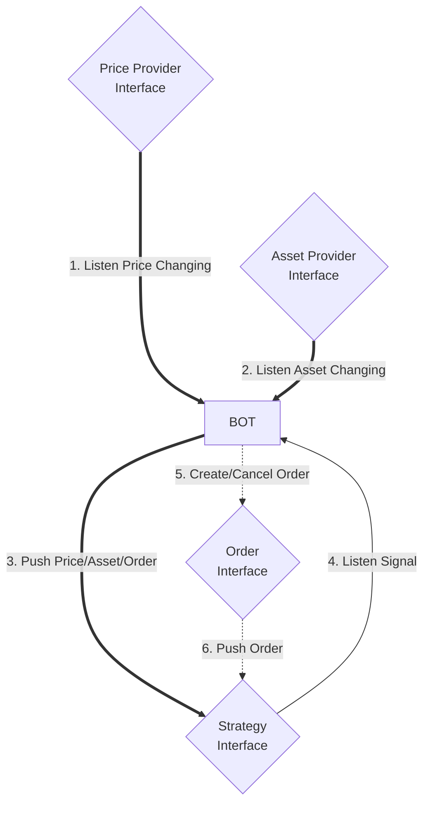

# Treasure Bowl

A simple crypto trading bot.

# Requirement
#### _Go 1.21.4 or higher_

# Flow Design

```mermaid
graph TD
    PriceProvider{"Price Provider\nInterface"}
    AssetProvider{"Asset Provider\nInterface"}
    Strategy{Strategy\nInterface}
    Order{Order\nInterface}

    PriceProvider ===>|1. Listen Price Changing| BOT
    AssetProvider ==>|2. Listen Asset Changing| BOT
    BOT ==>|3. Push Price/Asset/Order| Strategy 
    Strategy -->|4. Listen Signal| BOT
    BOT -.->|5. Create/Cancel Order| Order
    Order -.->|6. Push Order| Strategy
```